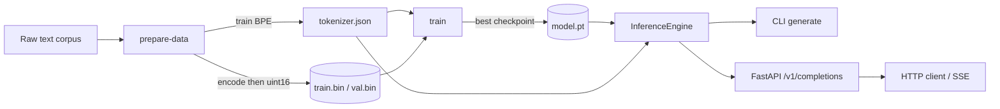

# BYO-SLM — Build Your Own Small Language Model

[](https://github.com/your-org/build-your-own-slm/actions/workflows/ci.yml)
[](https://www.python.org/)
[](LICENSE)
[](#testing)

A compact, **dependency-light, production-grade** implementation of a GPT-style
decoder-only transformer — built from first principles in PyTorch. Everything
you need to **tokenize, train, evaluate, generate, and serve** a Small Language
Model lives in this one repository, with the engineering rigour you would expect
of a service shipped to production: typed code, ~98% test coverage, structured
logging, metrics, rate limiting, auth, containerization, and CI/CD.

> Nothing here is a toy stub. The tokenizer is a real byte-level BPE you train
> yourself; the model is a real transformer; the server is a real FastAPI app
> with health checks, Prometheus metrics, and Server-Sent-Event streaming.

---

## Table of contents

- [Why this exists](#why-this-exists)
- [Features](#features)
- [Quick start](#quick-start)
- [How it works](#how-it-works)
- [Project layout](#project-layout)
- [The CLI](#the-cli)
- [Configuration](#configuration)
- [Serving & the API](#serving--the-api)
- [Testing](#testing)
- [Deployment](#deployment)
- [Documentation](#documentation)
- [License](#license)

---

## Why this exists

Most "build a GPT" tutorials stop at a training notebook. Most "serve an LLM"
tutorials assume someone else built the model. **This project covers the entire
lifecycle** and treats each stage as production software:

| Stage | What you get |
|-------|--------------|
| Tokenization | A trainable, lossless byte-level BPE tokenizer (no external tokenizer dependency) |
| Modeling | A clean, typed GPT implementation using fused FlashAttention kernels |
| Training | Mixed precision, gradient accumulation, cosine LR schedule, checkpointing, resume |
| Inference | A safe engine with streaming, stop sequences, and reproducible sampling |
| Serving | FastAPI with auth, rate limiting, metrics, structured logs, SSE streaming |
| Operations | Docker, Compose, CI/CD, health probes, runbook, security guide |

## Features

- 🔡 **From-scratch byte-level BPE** — GPT-2-style pre-tokenization and
  byte↔unicode mapping; trains in seconds with an incremental pair-count index.
- 🧠 **GPT model** — pre-norm transformer, weight tying, GPT-2 init, optional
  gradient checkpointing, and `scaled_dot_product_attention` (Flash) kernels.
- 🏋️ **Robust trainer** — AdamW with decoupled weight decay, warmup + cosine
  decay, gradient clipping, AMP (bf16/fp16), atomic & resumable checkpoints.
- ✍️ **Generation** — temperature, top-k, top-p (nucleus), repetition penalty,
  seedable/reproducible sampling, and correct incremental UTF-8 streaming.
- 🌐 **Production API** — OpenAI-style `/v1/completions` (buffered + SSE stream),
  API-key auth, token-bucket rate limiting, Prometheus metrics, security headers.
- 🧪 **~98% test coverage** — unit, integration, API, and CLI tests.
- 🐳 **Ship it** — multi-stage non-root Docker image, Compose stack with
  Prometheus, GitHub Actions CI (lint, types, tests on 3.10–3.12) and release.

## Quick start

```bash
# 1. Install (CPU PyTorch shown; see docs for CUDA)
python -m venv .venv && source .venv/bin/activate
pip install torch --index-url https://download.pytorch.org/whl/cpu
pip install -e ".[dev]"

# 2. Prepare data + train the tokenizer (downloads tiny-shakespeare ~1 MB)
slm prepare-data --config configs/tiny.yaml

# 3. Train the tiny model — a few minutes on a GPU, up to ~1 hour on CPU
slm train --config configs/tiny.yaml

# 4. Generate text
slm generate --model-dir checkpoints/tiny --prompt "To be, or not to be"

# 5. Serve it
SLM_MODEL_DIR=checkpoints/tiny slm serve
# ... then in another shell:
curl -s localhost:8000/v1/completions \
  -H 'content-type: application/json' \
  -d '{"prompt":"To be, or not to be","max_tokens":40}' | jq
```

Prefer containers? `docker compose up --build` (after training a model into
`./checkpoints/tiny`).

## How it works



A raw corpus is tokenized once into memory-mappable binaries. Training samples
random windows from those binaries and writes the best checkpoint by validation
loss. The same checkpoint + tokenizer are loaded by the inference engine, which
backs both the CLI and the HTTP API. See **[docs/architecture.md](docs/architecture.md)**
for the full design, diagrams, and rationale.

## Project layout

```
build-your-own-slm/
├── src/slm/
│   ├── config.py            # Settings (env) + ExperimentConfig (YAML)
│   ├── tokenizer.py         # Byte-level BPE: train / encode / decode / save
│   ├── data.py              # Dataset prep + memmap batching
│   ├── model/               # GPT, transformer blocks, attention
│   ├── training/            # Trainer, LR schedule, checkpointing
│   ├── generation/          # Sampling strategies + token streaming
│   ├── inference/           # InferenceEngine (load + generate + stream)
│   ├── api/                 # FastAPI app, routes, schemas, security, metrics
│   ├── cli.py               # `slm` Typer command-line interface
│   ├── logging_config.py    # structlog setup (console/JSON)
│   └── utils.py             # seeding, device, dtype helpers
├── tests/                   # unit + integration (API, CLI, training)
├── configs/                 # tiny.yaml, small.yaml experiment recipes
├── docs/                    # architecture, api, training, deployment, security…
├── docker/                  # prometheus.yml
├── Dockerfile, docker-compose.yml
├── .github/workflows/       # ci.yml, release.yml
└── pyproject.toml           # build, deps, ruff, mypy, pytest, coverage
```

Every module, class, and function is documented inline; see
**[docs/developer-guide.md](docs/developer-guide.md)** for a guided tour.

## The CLI

| Command | Purpose |
|---------|---------|
| `slm prepare-data --config <yaml>` | Train the tokenizer and write token binaries |
| `slm train --config <yaml> [--resume]` | Train (or resume) a model |
| `slm generate --model-dir <dir> --prompt <text>` | Sample from a trained model |
| `slm serve [--host --port --workers --reload]` | Run the HTTP inference server |
| `slm info` | Print effective runtime settings |

Run `slm --help` or `slm <command> --help` for all options.

## Configuration

Two clearly separated surfaces (see [docs/architecture.md](docs/architecture.md#configuration)):

- **Experiment recipes** (`configs/*.yaml`) — architecture, optimizer, data,
  tokenizer, and training schedule. Versioned in git.
- **Runtime settings** (`SLM_*` environment variables, see `.env.example`) —
  device, model directory, API host/port, CORS, **API keys**, rate limits.
  Follows the [Twelve-Factor](https://12factor.net/config) methodology.

## Serving & the API

OpenAI-compatible surface so existing tooling transfers:

```bash
# Buffered
curl localhost:8000/v1/completions -H 'content-type: application/json' \
  -H "x-api-key: $KEY" \
  -d '{"prompt":"Hello","max_tokens":32,"temperature":0.8,"top_p":0.95}'

# Streaming (Server-Sent Events)
curl -N localhost:8000/v1/completions -H 'content-type: application/json' \
  -d '{"prompt":"Hello","max_tokens":32,"stream":true}'
```

Interactive docs at `/docs` (Swagger) and `/redoc`; machine spec at
`/openapi.json` (a snapshot is committed at [docs/openapi.json](docs/openapi.json)).
Health at `/healthz` (liveness) and `/readyz` (readiness); metrics at `/metrics`.
Full reference: **[docs/api.md](docs/api.md)**.

## Testing

```bash
make test          # full suite + coverage (term + xml)
make test-fast     # skip slow markers
make check         # lint + typecheck + test (CI parity)
```

The suite trains a real (tiny) model once per session and exercises the entire
pipeline, the HTTP API (auth, streaming, validation, rate limiting, errors), and
the CLI. Coverage gate is **≥ 95%**.

## Deployment

- **Docker:** `docker build -t byo-slm .` → run with `-e SLM_API_KEYS=… -v $PWD/checkpoints:/app/checkpoints:ro`.
- **Compose:** `docker compose up --build` (add `--profile monitoring` for Prometheus).
- **Kubernetes / autoscaling / rollbacks:** see **[docs/deployment.md](docs/deployment.md)**.
- **Operating it:** **[docs/operations-runbook.md](docs/operations-runbook.md)**.

## Documentation

| Doc | Contents |
|-----|----------|
| [architecture.md](docs/architecture.md) | High/low-level design, diagrams, trade-offs, scalability, DR |
| [api.md](docs/api.md) | Endpoints, auth, errors, status codes, examples |
| [training.md](docs/training.md) | Data prep, recipes, schedules, scaling a model up |
| [deployment.md](docs/deployment.md) | Docker, Compose, Kubernetes, CI/CD, rollback |
| [operations-runbook.md](docs/operations-runbook.md) | Alerts, dashboards, incident playbooks |
| [security.md](docs/security.md) | Threat model, OWASP mapping, secrets, hardening |
| [developer-guide.md](docs/developer-guide.md) | Codebase tour, conventions, how to extend |

## License

Apache License 2.0 — see [LICENSE](LICENSE). Contributions welcome; see
[CONTRIBUTING.md](CONTRIBUTING.md).
