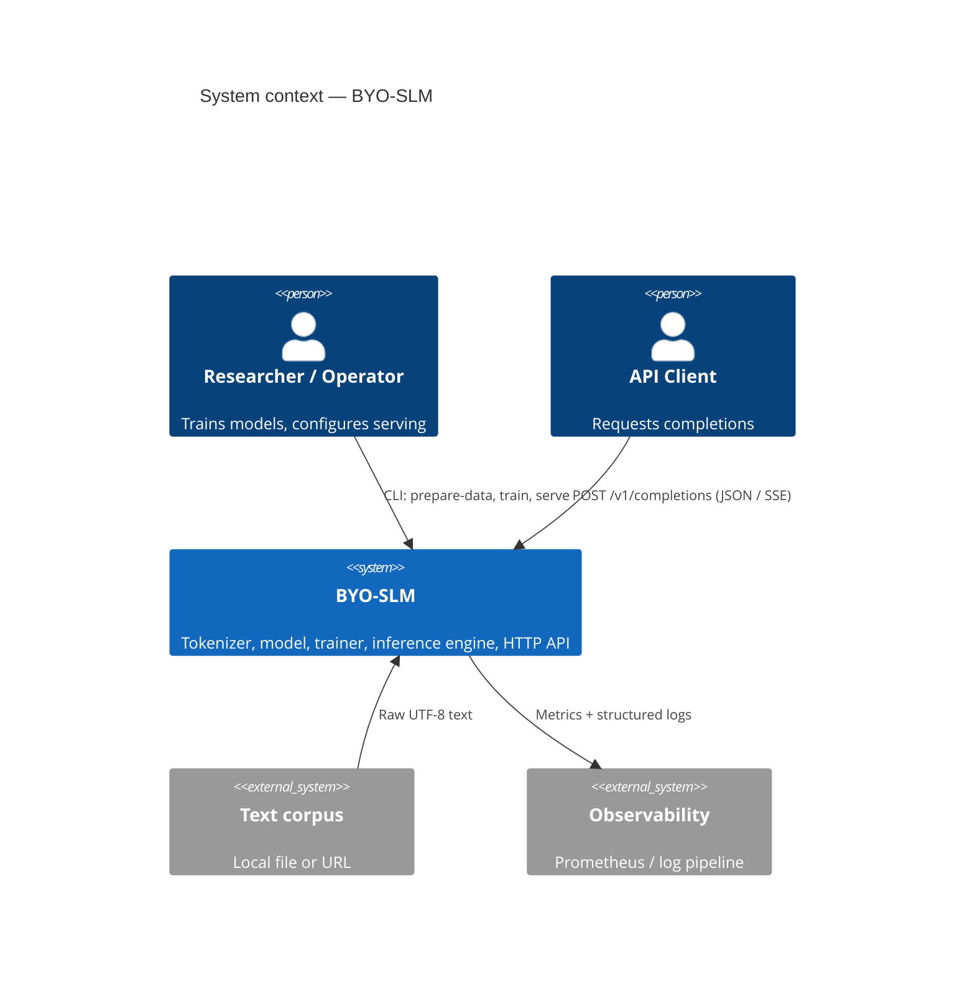
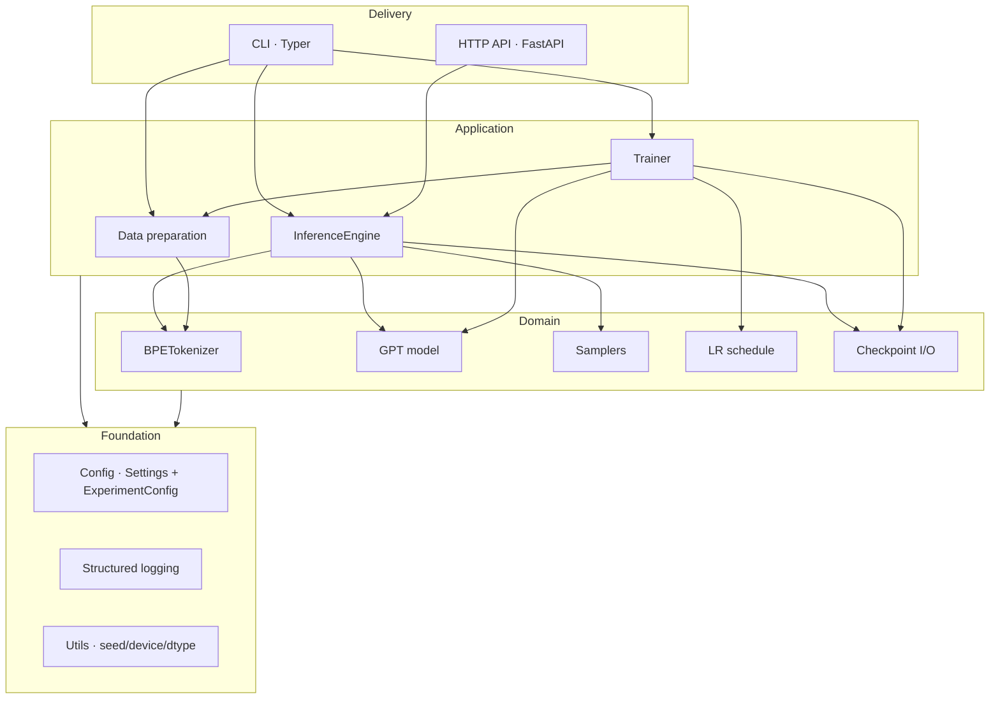
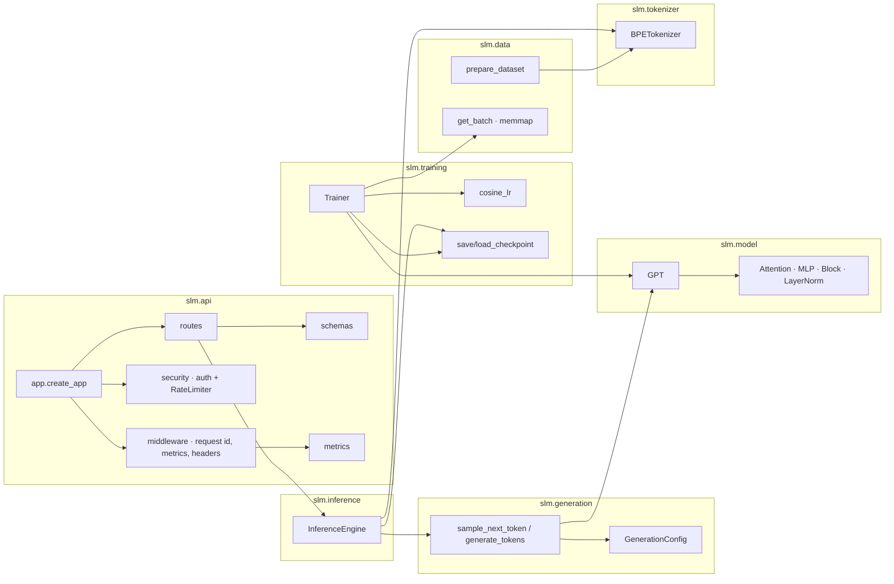
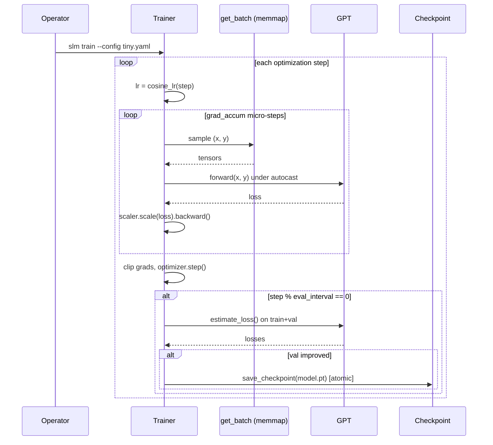
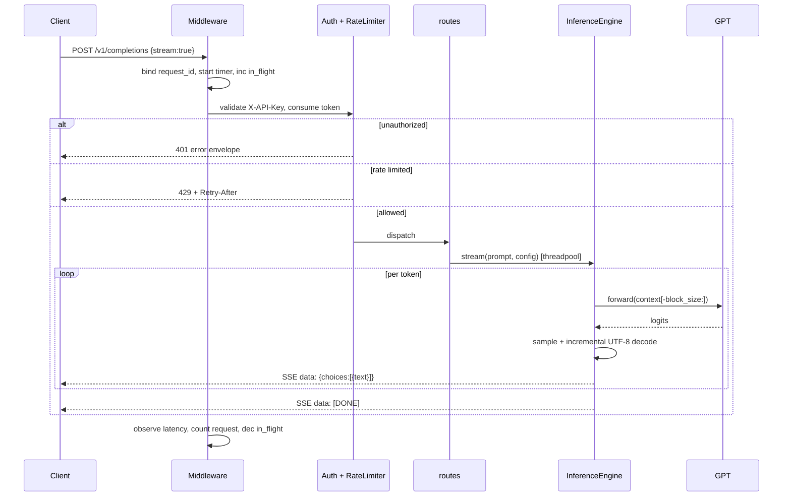
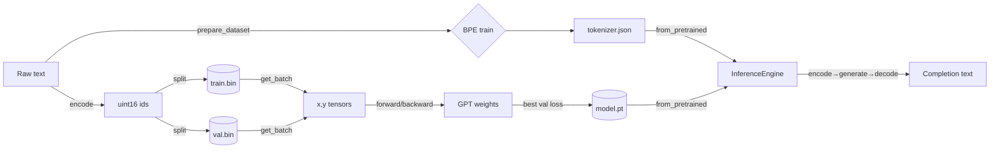
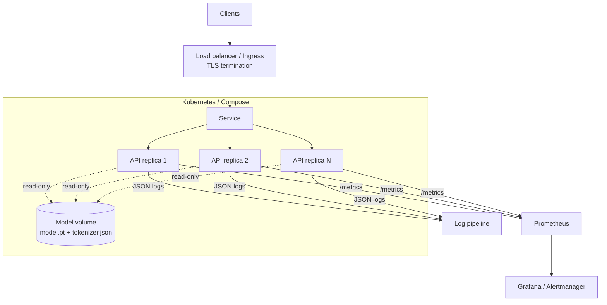

# Architecture

This document describes the design of BYO-SLM from the 30,000-foot view down to
individual components, the rationale behind key decisions, and the operational
properties (scalability, reliability, security, cost) that fall out of them.

- [System context](#system-context)
- [High-level architecture](#high-level-architecture)
- [Low-level architecture](#low-level-architecture)
- [Sequence diagrams](#sequence-diagrams)
- [Data flow](#data-flow)
- [Deployment architecture](#deployment-architecture)
- [Configuration](#configuration)
- [Design rationale & technology trade-offs](#design-rationale--technology-trade-offs)
- [Scalability](#scalability)
- [Performance](#performance)
- [Security architecture](#security-architecture)
- [Reliability, fault tolerance & disaster recovery](#reliability-fault-tolerance--disaster-recovery)
- [Cost optimization](#cost-optimization)
- [Future extensibility](#future-extensibility)

---

## System context

There are two actors and three lifecycle phases. The **researcher/operator**
prepares data and trains models offline; the **API client** consumes the trained
model online over HTTP.

## High-level architecture

The codebase is a layered **clean architecture**: domain logic (tokenizer,
model, sampling) has no knowledge of delivery mechanisms (CLI, HTTP). Each layer
depends only inward.

**Dependency rule.** `slm.model`, `slm.tokenizer`, and `slm.generation` never
import `slm.api`. The API and CLI are interchangeable delivery adapters over the
same `InferenceEngine`. This is what makes the engine equally usable from a unit
test, a notebook, the CLI, or the web server.

## Low-level architecture

Component responsibilities and their interactions:

### Module reference

| Module | Responsibility | Key public symbols |
|--------|----------------|--------------------|
| `slm.config` | Typed config: env `Settings`, YAML `ExperimentConfig` | `Settings`, `ExperimentConfig`, `load_experiment_config` |
| `slm.tokenizer` | Byte-level BPE | `BPETokenizer` |
| `slm.data` | Dataset prep + memmap batching | `prepare_dataset`, `get_batch`, `load_token_bin` |
| `slm.model` | Transformer | `GPT`, `Block`, `CausalSelfAttention`, `MLP`, `LayerNorm` |
| `slm.generation` | Sampling | `GenerationConfig`, `generate_tokens`, `sample_next_token` |
| `slm.training` | Trainer, schedule, checkpoints | `Trainer`, `cosine_lr`, `save_checkpoint`, `load_checkpoint` |
| `slm.inference` | Serving-facing engine | `InferenceEngine`, `GenerationResult`, `ModelMetadata` |
| `slm.api` | FastAPI app | `create_app` |
| `slm.cli` | Command-line entrypoint | `app` |

## Sequence diagrams

### Training step

### Streaming completion request

## Data flow

Token ids are stored as `uint16` (the vocabulary fits in 16 bits), so a 1-billion
token corpus is a 2 GB file that is **memory-mapped**, never fully read into RAM.

## Deployment architecture

The API is **stateless** — each replica loads the same read-only checkpoint at
startup. Horizontal scaling is therefore linear and rollbacks are a pointer swap
to a previous image/model. Rate-limit state is per-replica in the default
in-memory limiter; see [security.md](security.md) for the Redis-backed option
when global limits are required.

## Configuration

Two surfaces are deliberately separated so secrets and serving knobs never mix
with the immutable training recipe.

| | Experiment config | Runtime settings |
|--|--|--|
| Source | `configs/*.yaml` | `SLM_*` environment variables |
| Model | `ExperimentConfig` (frozen pydantic) | `Settings` (frozen pydantic-settings) |
| Lifecycle | Versioned in git, immutable per run | Per-deployment, may hold secrets |
| Examples | layers, heads, LR, batch size | device, API keys, rate limits, CORS |

`ExperimentConfig` validates cross-field invariants up front (e.g. `n_embd`
divisible by `n_head`, tokenizer/model vocab kept in sync), so misconfigurations
fail at load time, not three hours into training.

## Design rationale & technology trade-offs

| Decision | Why | Trade-off considered |
|----------|-----|----------------------|
| **PyTorch** | De-facto research standard, `scaled_dot_product_attention` gives Flash kernels for free, eager mode is debuggable | JAX (faster XLA, smaller ecosystem); raw CUDA (max perf, huge effort) |
| **From-scratch BPE** (no `tokenizers` dep) | Educational goal; zero native build deps; full control of format | HF `tokenizers` is faster in Rust — but adds a heavy dependency and hides the mechanics |
| **Byte-level BPE** | Lossless on any input, no UNK token, language-agnostic | Slightly longer sequences than word-level on English |
| **Learned positional embeddings** | Simple, matches GPT-2, adequate at small context | RoPE/ALiBi extrapolate better to longer contexts (see [extensibility](#future-extensibility)) |
| **FastAPI + uvicorn** | Async, Pydantic validation, automatic OpenAPI, SSE support | Flask (sync, simpler); gRPC (faster, less ubiquitous for LLM clients) |
| **Pydantic v2 everywhere** | One validation model for config *and* API; fast Rust core | Dataclasses are lighter but lack validation/serialisation |
| **structlog** | Same call site emits console *or* JSON; context binding for request ids | stdlib logging alone is more verbose to make structured |
| **uint16 memmap dataset** | O(1) RAM, zero per-batch tokenisation cost | Caps vocab at 65 536; fine for small models |
| **Token-bucket rate limit (in-proc)** | No external dependency for single-replica; smooth bursts | Not globally consistent across replicas (documented Redis swap) |

## Scalability

- **Training** scales *vertically* (bigger GPU, bf16, `torch.compile`,
  `gradient_checkpointing`) and along the *effective batch* axis via
  `grad_accum_steps`. Data preparation is linear in corpus size and one-shot.
- **Serving** scales *horizontally*: stateless replicas behind a load balancer.
  Throughput per replica is bounded by autoregressive decoding (one forward pass
  per token). Because the model is small, a single CPU replica already serves
  interactive latencies; GPUs add headroom for concurrency.
- **Context length** scales with `block_size` at O(T²) attention cost; the
  memmap pipeline and generation context-cropping both handle arbitrary lengths.

## Performance

- **Flash attention** via `F.scaled_dot_product_attention` (memory-efficient,
  fused) on the hot path; a numerically identical manual fallback covers old
  torch.
- **Mixed precision** (bf16 preferred, fp16 with `GradScaler` fallback) roughly
  halves memory and increases throughput; `autocast_dtype` degrades gracefully
  per device so the same recipe runs on CPU/GPU/MPS.
- **Inference optimisation**: when no targets are supplied the model computes
  logits for the *last position only*, avoiding a full-sequence projection each
  step.
- **Blocking work off the event loop**: generation runs in a threadpool
  (`run_in_threadpool` / `iterate_in_threadpool`) so the async server stays
  responsive and streams without head-of-line blocking.
- **Zero-copy data**: `np.memmap` + pinned-memory async H2D copies on CUDA.

## Security architecture

Defence in depth — see [security.md](security.md) for the full threat model and
OWASP mapping.

Key properties: API keys compared with `hmac.compare_digest`; key material never
logged (only a salted id); strict request schemas reject unknown fields; the
generic exception handler hides internals in production; the container runs as a
non-root user with a read-only model mount.

## Reliability, fault tolerance & disaster recovery

- **Atomic checkpoints** — writes go to `model.pt.tmp` then `rename`, so a crash
  mid-save never corrupts the last good checkpoint.
- **Resumable training** — optimizer state + step are persisted; `--resume`
  continues exactly where it stopped.
- **Health probes** — `/healthz` (liveness) and `/readyz` (readiness, 503 until
  the model is loaded) drive orchestrator restart/rollout decisions.
- **Graceful degradation** — if no model is present the API still starts and
  serves health endpoints, returning `503` for inference rather than crash-looping.
- **Disaster recovery** — the only stateful artifacts are checkpoints +
  tokenizer (and the source corpus/recipe, which fully reproduce them). Back
  these up to object storage; recovery is "pull artifacts, redeploy". RPO =
  last checkpoint interval; RTO = image pull + model load (seconds–minutes). See
  [operations-runbook.md](operations-runbook.md#backup--restore).

## Cost optimization

- Small models serve acceptably **on CPU**, eliminating GPU cost for many use
  cases; `SLM_DEVICE` selects hardware without code changes.
- `uint16` storage halves dataset footprint; memmap avoids large-RAM instances.
- Stateless replicas enable **scale-to-zero / autoscaling** on request volume.
- Multi-stage Docker build keeps the runtime image lean (no build toolchain).
- bf16 training reduces GPU-hours; `gradient_checkpointing` lets a given model
  fit on cheaper, smaller-memory GPUs.

## Future extensibility

The seams designed for growth:

- **Tokenizer** — `BPETokenizer` is versioned (JSON `version` field) for
  forward-compatible format changes; the regex pre-tokenizer is pluggable.
- **Positional scheme** — attention is isolated in `layers.py`; swapping learned
  embeddings for **RoPE/ALiBi** touches only the attention/embedding code.
- **KV cache** — `generate_tokens` is the single decode loop; adding a key/value
  cache for O(T) (instead of O(T²)) decoding is a localised change.
- **Multiple models** — the API resolves a single engine from `app.state`; a
  registry keyed by model id extends `/v1/models` and routing.
- **Distributed training** — the `Trainer` is single-process today; DDP wraps the
  model and shards `get_batch` without changing the loss/checkpoint contracts.
- **Backpressure / global limits** — `RateLimiter.allow` is the one extension
  point for a Redis or sliding-window limiter.
