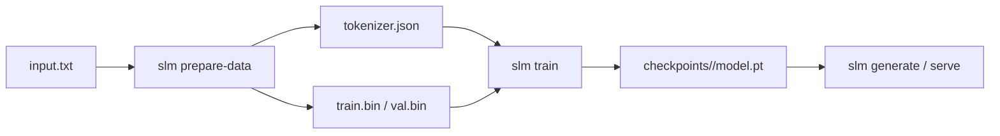

# Training Guide

End-to-end: from a raw corpus to a served checkpoint, plus how to scale the
model up and tune the run.

- [The pipeline](#the-pipeline)
- [1. Prepare data](#1-prepare-data)
- [2. Train](#2-train)
- [3. Evaluate & generate](#3-evaluate--generate)
- [Anatomy of a recipe](#anatomy-of-a-recipe)
- [Choosing hyperparameters](#choosing-hyperparameters)
- [Scaling the model up](#scaling-the-model-up)
- [Resuming & checkpoints](#resuming--checkpoints)
- [Custom corpora](#custom-corpora)
- [Reproducibility](#reproducibility)
- [Troubleshooting](#troubleshooting)

## The pipeline



## 1. Prepare data

```bash
slm prepare-data --config configs/tiny.yaml
```

This (a) resolves the raw corpus (downloads `data.source_url` if the local
`raw_file` is absent), (b) trains a byte-level BPE tokenizer to
`tokenizer.vocab_size`, (c) encodes the whole corpus to `uint16` token ids, and
(d) writes `train.bin` / `val.bin` split by `data.val_fraction`. Re-run with
`--no-retrain-tokenizer` to reuse an existing tokenizer.

## 2. Train

```bash
slm train --config configs/tiny.yaml          # fresh run
slm train --config configs/tiny.yaml --resume # continue from last checkpoint
```

The trainer logs steps and periodic eval; it saves `model.pt` whenever
validation loss improves (or every eval if `always_save_checkpoint: true`) and
co-locates `tokenizer.json` next to the checkpoint for serving.

## 3. Evaluate & generate

```bash
slm generate --model-dir checkpoints/tiny --prompt "Once upon a time" \
  --max-tokens 100 --temperature 0.8 --top-k 40 --top-p 0.95
```

Validation loss is reported during training; for language models, **perplexity =
exp(loss)** is the headline metric.

## Anatomy of a recipe

`configs/tiny.yaml`, annotated:

```yaml
model:                 # architecture (see slm.config.ModelConfig)
  block_size: 256      # context window in tokens; attention cost is O(block_size²)
  n_layer: 4           # transformer blocks (depth)
  n_head: 4            # attention heads; n_embd must be divisible by n_head
  n_embd: 128          # residual stream width
  dropout: 0.1
optim:                 # slm.config.OptimConfig
  lr: 1.0e-3           # peak LR after warmup
  warmup_steps: 100    # linear ramp
  lr_decay_steps: 2000 # cosine decay reaches min_lr here
  min_lr: 1.0e-4
train:                 # slm.config.TrainConfig
  max_steps: 2000
  batch_size: 32
  grad_accum_steps: 1  # effective batch = batch_size × grad_accum_steps
  dtype: bfloat16      # bf16 → fp16 → fp32 auto-degrade per device
```

## Choosing hyperparameters

| Symptom | Lever |
|---------|-------|
| Loss plateaus high / underfitting | ↑ `n_layer`/`n_embd`, ↑ `max_steps`, ↑ `lr` |
| Train ≪ val loss (overfitting) | ↑ `dropout`, ↑ data, ↓ model size, early stop |
| Loss diverges / NaN | ↓ `lr`, ensure `grad_clip>0`, prefer bf16 over fp16 |
| Out-of-memory | ↓ `batch_size` and raise `grad_accum_steps`; enable `gradient_checkpointing`; ↓ `block_size` |
| Slow steps | enable `compile: true` (CUDA), use bf16, larger `batch_size` |

Rules of thumb: keep `warmup_steps` ≈ 1–5% of `max_steps`; set `lr_decay_steps ≈
max_steps`; `min_lr ≈ lr/10`; bf16 on Ampere+ GPUs.

## Scaling the model up

`configs/small.yaml` (~30M params) shows the next tier: deeper/wider model,
`block_size: 512`, larger vocab, `grad_accum_steps: 4` for an effective batch of
256, `compile: true`. To go further:

1. Increase `n_layer`/`n_embd`/`block_size` and `tokenizer.vocab_size`.
2. Provide a **much larger corpus** — parameters without data overfit.
3. Raise the effective batch via `grad_accum_steps` rather than `batch_size`
   when memory-bound.
4. For multi-GPU, wrap the model in DDP (see
   [architecture.md](architecture.md#future-extensibility)).

Compute budget intuition (Chinchilla): aim for roughly **~20 tokens per
parameter** of training data.

## Resuming & checkpoints

A checkpoint (`model.pt`) stores the model weights, the exact `ModelConfig`, the
optimizer state, the step, the best validation loss, and the full experiment
recipe — everything needed to resume or to serve. Writes are atomic
(`*.tmp`→rename). `--resume` restores all of it and continues; raise
`train.max_steps` first to actually train further.

## Custom corpora

Drop your text at `data.data_dir/data.raw_file` and remove `data.source_url`:

```yaml
data:
  data_dir: ./data
  raw_file: my_corpus.txt   # your UTF-8 text
  val_fraction: 0.1
```

Any UTF-8 is supported (the byte-level tokenizer is lossless). For multiple
files, concatenate them (optionally inserting `<|endoftext|>` between documents).

## Reproducibility

`train.seed` seeds Python, NumPy, and PyTorch and the batch-sampling RNG. With a
fixed seed and device, runs are deterministic up to non-deterministic GPU kernels
(use `set_seed(seed, deterministic=True)` to force determinism at a throughput
cost). Sampling is reproducible via the `seed` generation parameter.

## Troubleshooting

| Error | Cause / fix |
|-------|-------------|
| `Token binary not found … Run slm prepare-data` | Run `prepare-data` before `train` |
| `Raw text … not found and no data.source_url` | Provide a local `raw_file` or set `source_url` |
| `n_embd … must be divisible by n_head` | Fix the model config |
| `vocab_size … does not fit in uint16` | Reduce `tokenizer.vocab_size` below 65 536 |
| `Dataset has N tokens … too small for block_size` | Use more data or a smaller `block_size` |
| NaN loss | Lower `lr`, keep `grad_clip`, switch fp16→bf16 |
